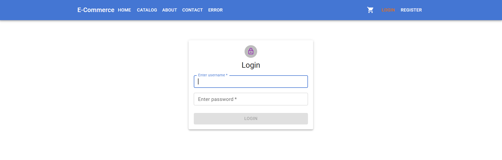
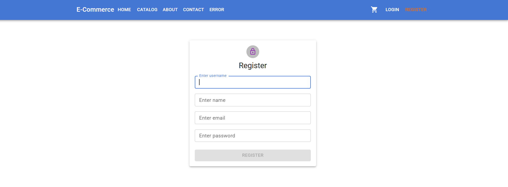
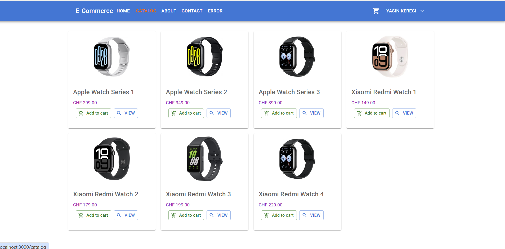
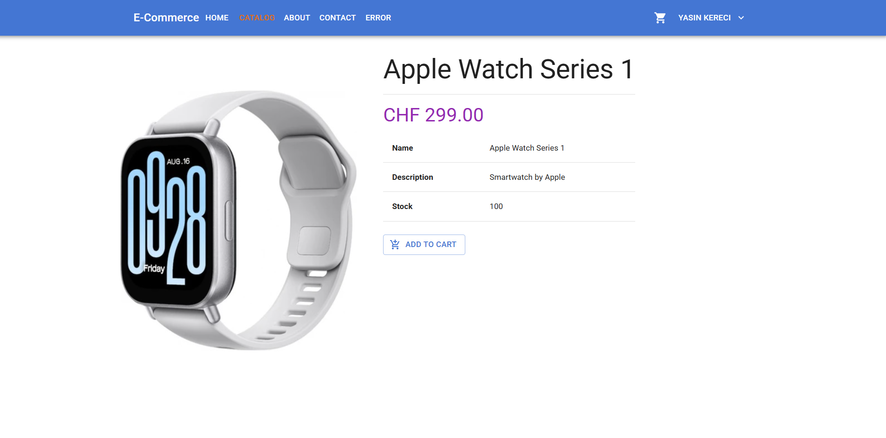
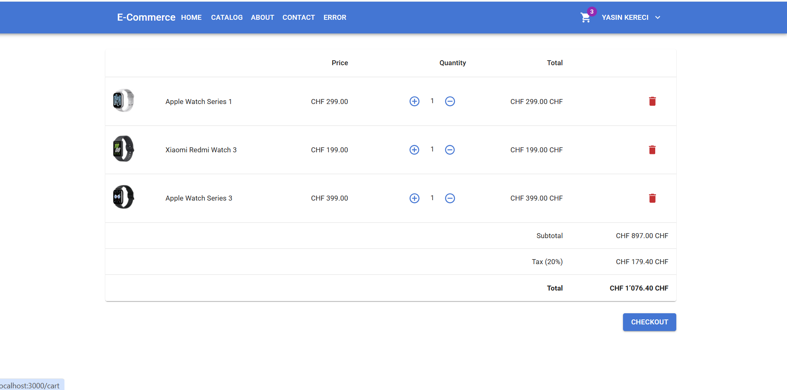
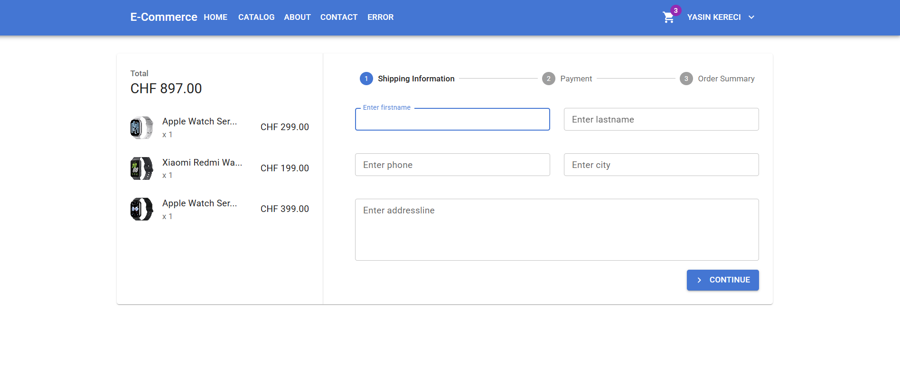
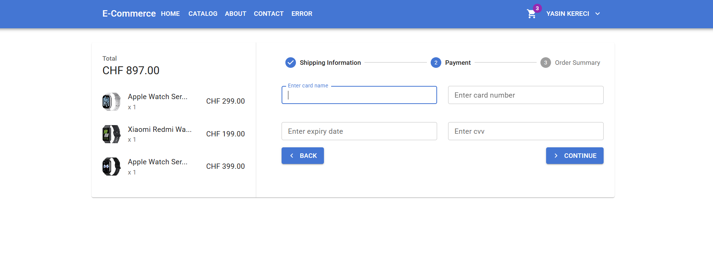
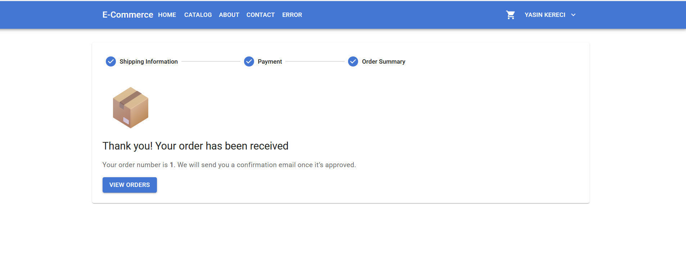

# 🛒 ADP E-Commerce Fullstack Projekt

Dieses Projekt ist ein vollständiges E-Commerce-Webanwendungssystem, das von zwei Entwicklern mit ASP.NET Core 9 und React + Material UI von Grund auf entwickelt wurde. Es beinhaltet sowohl **Backend** als auch **Frontend**, vollständig integriert.

## 👥 Entwickler

- **Yasin Kereci** – `kereciyasin` – 📧 yke144907@stud.gibb.ch  
- **Yavuz Özbay** – `yavuzozbay` – 📧 yoe144963@stud.gibb.ch

---

## 🚀 Verwendete Technologien

### Backend:
- ASP.NET Core 9.0
- Entity Framework Core
- Identity API
- JWT (JSON Web Token)
- Middleware & Static Files
- CORS
- Zahlungsintegration mit Iyzico (in Vorbereitung)

### Frontend:
- React.js (mit Vite)
- TypeScript
- Material UI
- React Router v7
- Redux Toolkit
- Context API

---

## 📦 Funktionsübersicht

- 👤 Benutzerregistrierung & Login mit JWT
- 🛒 Warenkorbverwaltung
- ✅ Bestellungen erstellen und anzeigen
- 🛠️ Rollenbasierter Zugriff (Kunde)
- 📷 Produktbilder in der Übersicht
- 📚 API-Kommunikation über HTTP
- 🧾 Swagger Dokumentation (OpenAPI)

---

## 👤 Test-Benutzer

### 👨‍💼 Kunde:

```
E-Mail: yoe144963@stud.gibb.ch  
Benutzername: yavuzozbay  
Passwort: Admin_123
```

---


### 👨‍💼 Kunde:

```
E-Mail: yke144907@stud.gibb.ch  
Benutzername: kereciyasin  
Passwort: Customer_123
```

---

## 📷 Screenshots

Login:



Register:



Catalog:



Catalog Details:



Warenkorb:



Bestellung:




Zahlung:

💳 Zahlungsintegration mit iyzico
Für die Zahlungsabwicklung wurde iyzico als externer Zahlungsanbieter integriert. Die Kommunikation erfolgt über die offizielle iyzipay-dotnet-Bibliothek.

Verwendet wird die Sandbox API für Testzahlungen

Kreditkartendaten werden über ein sicheres Formular übermittelt

Unterstützte Währungen: EUR, USD, CHF

Für Fremdwährungen wie EUR oder CHF werden Cross-Border Testkarten benötigt

Ablauf beim Bezahlen (Back-End):

Der Nutzer gibt beim Checkout seine Kreditkartendaten ein

Die Bestellung wird erstellt und ein Zahlungsobjekt mit der iyzico-API generiert

Zahlungsinformationen wie Name, Adresse, IP und Warenkorbinhalt werden übergeben

iyzico antwortet mit dem Zahlungsstatus (success oder failure)

Bei Erfolg wird die Bestellung in der Datenbank gespeichert

Codebeispiel: (verkürzt)
```json
Options options = new Options {
    ApiKey = _config["PaymentAPI:APIKey"],
    SecretKey = _config["PaymentAPI:SecretKey"],
    BaseUrl = "https://sandbox-api.iyzipay.com"
};

CreatePaymentRequest request = new CreatePaymentRequest {
    Currency = Currency.EUR.ToString(),
    PaymentCard = new PaymentCard {
        CardHolderName = model.CardName,
        CardNumber = model.CardNumber,
        ...
    },
    Buyer = new Buyer {
        Name = model.FirstName,
        Surname = model.LastName,
        Country = "Switzerland"
    },
    ...
};

var paymentResult = Payment.Create(request, options);
```
💡 Für EUR/CHF-Zahlungen muss eine internationale Testkarte verwendet werden, z. B. 5400010000000004 (Visa – Cross-Border).
Weitere Informationen zur Integration:
👉 iyzico Developer Docs



Bestätigung:



---

## ⚙️ Projekt lokal ausführen

### 🔧 Backend (ASP.NET Core API)

1. Konfiguriere die Datenbankverbindung in `appsettings.json`:

```json
{
    "Logging": {
        "LogLevel": {
            "Default": "Information",
            "Microsoft.AspNetCore": "Warning"
        }
    },
    "ConnectionStrings": {
        "DefaultConnection": "Server=localhost;Port=3306;Database=ecommerce;User=root;Password= ;"
    },
    "JWTSecurity": {
        "SecretKey": " "
    },
    "PaymentAPI": {
        "ApiKey": " ",
        "SecretKey": " "
    }
}
```

2. Migration anwenden und Datenbank erstellen:

```bash
dotnet ef database update
```

3. API starten:

```bash
dotnet run
```

> Die API läuft auf: `http://localhost:5025`

---

### 💻 Frontend (React - Vite)

1. In das `client/` Verzeichnis wechseln:

```bash
cd client
```

2. Abhängigkeiten installieren:

```bash
npm install
```

3. Anwendung starten:

```bash
npm run dev
```

> Die Anwendung läuft auf: `http://localhost:3000`

4. `.env` Datei konfigurieren:

```env
VITE_API_URL=http://localhost:5025
```

---

## 📁 Projektstruktur

```
ADP-ECommerce/
├── API/
│   ├── Controllers/
│   ├── Data/
│   ├── DTO/
│   ├── Entity/
│   ├── Middlewares/
│   ├── Migrations/
│   ├── Services/
│   ├── Program.cs
│   └── appsettings.json
├── client/
│   ├── src/
│   ├── src/
│   ├── public/
│   └── .env
├── README.md
```

---


## 🤝 Beitrag & Weiterentwicklung

Dieses Projekt wurde zu Lern- und Portfoliozwecken entwickelt. Du kannst es gerne forken, erweitern oder verbessern. Für neue Features oder Bugmeldungen kannst du ein Issue eröffnen.

---

## 📄 Lizenz

Dieses Projekt ist ausschließlich für **Bildungszwecke und persönliche Nutzung** gedacht. Für kommerzielle Verwendung kontaktiere bitte die Entwickler.
